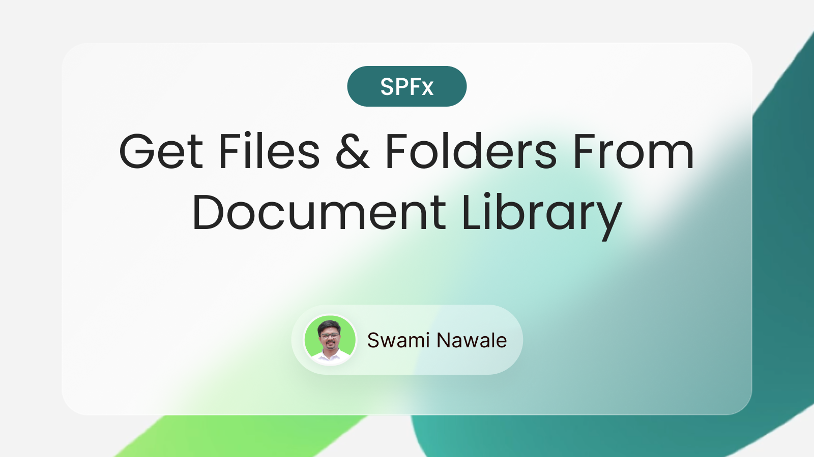

# 📂 SPFx File & Folder Explorer (SPFx + PnPjs)

A lightweight SharePoint Framework (SPFx) web part that **retrieves folders and files** from any SharePoint document library using **PnPjs**.  
Great for SPFx beginners and developers building file-driven intranet solutions.

---

## ✨ Features

1. **Fetches web-level folders** (site contents root).
2. **Gets list-level folders** from any document library.
3. **Retrieves specific folder contents** using folder ID.
4. Supports both **server-relative** and **absolute URLs**.
5. Displays folder info and metadata in clean JSON format.

---

## 🛠️ Libraries

- **React** – v17.0.1
- **PnP Js** – v4.13.0
- **Node** - v18.20.3

---

## 🤳 Connect with Me

- **Name:** Swami Nawale
- **LinkedIn:** [Swami Nawale](https://www.linkedin.com/in/swaminawale/)
- **YouTube:** [My Channel](https://www.youtube.com/channel/UC4hxCifc4RFPPbUPxE9oO0w)

---

## 🔖 Hashtags

## `#SharePoint #SPFx #SharePointFramework #PnPjs #Microsoft365 #Office365 #SPFxWebPart #SharePointDevelopment #PnP #DocumentLibrary`

---

## 📺 Watch the Video

